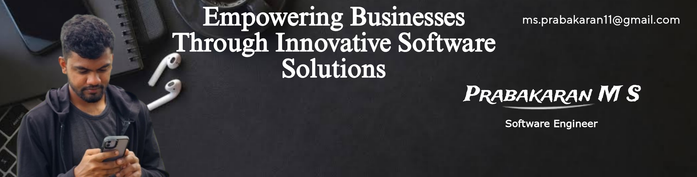
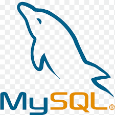

# Prabakaran M S | Software Engineer | MCA Graduate

Passionate coder exploring software development, data analysis, and continuous learning.

## About Me

Hello! I'm Prabakaran M S, a software enthusiast with skills in Python, JavaScript, HTML, CSS, Bootstrap, and more. I'm dedicated to creating smart solutions and exploring new technologies.

## Skills

### Programming Languages
-  C
-  Python
-  JavaScript

### Tools and Frameworks
-  Jupyter Notebook
-  Visual Studio
-  Bootstrap

### Web Development
-  HTML5
-  CSS3

### Database
-  MySQL

## Connect with Me

- LinkedIn: [Prabakaran M S](https://www.linkedin.com/in/prabakaran-m-s-897782182/)
- GitHub: [Prabakaran-MS](https://github.com/Prabakaran-MS)
- Email: ms.prabakaran11@gmail.com
- Instagram: [prabakaran.ms](https://www.instagram.com/prabakaran.ms/)

---

